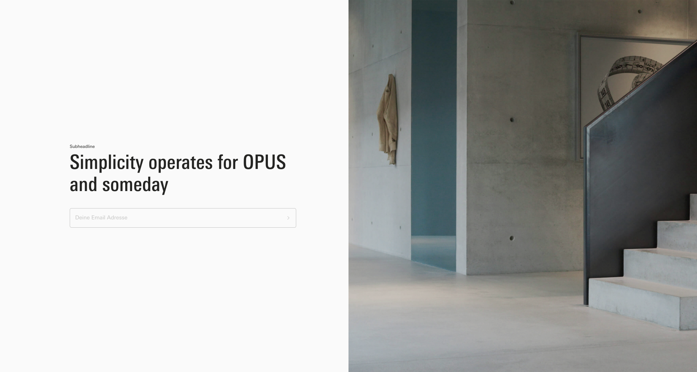
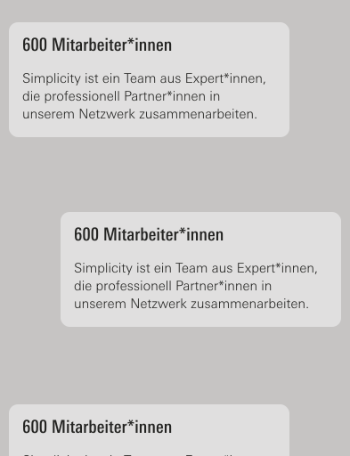
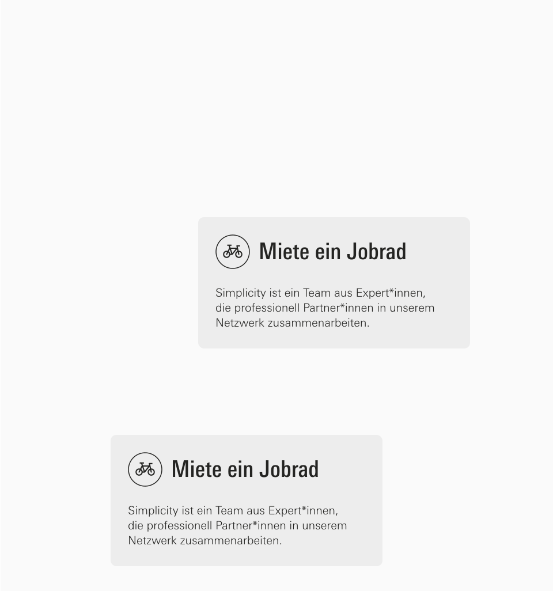
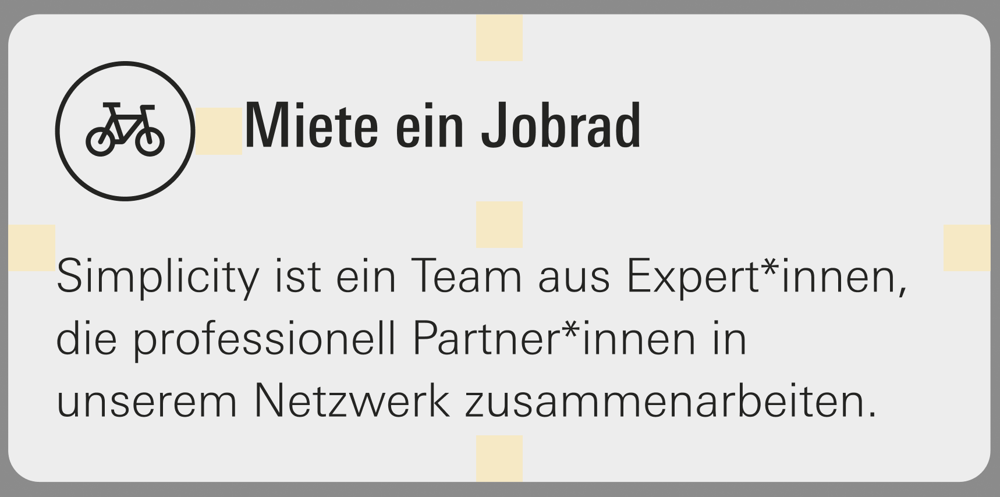
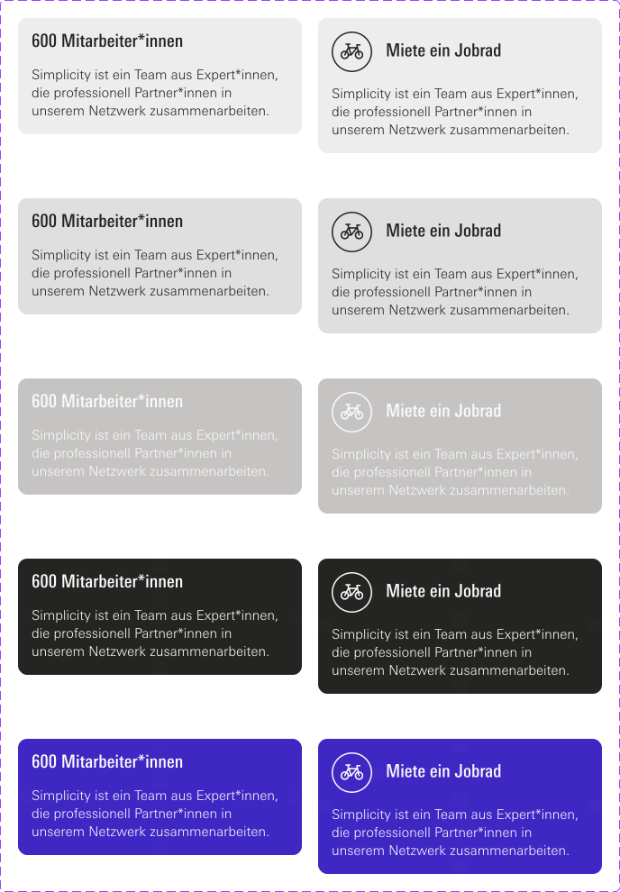

# Task Description

## Introduction

Another agency made a screen design, which describes different types of layouts. One of them is the splitscreen layout. See the two images below for mobil and desktop view,

Split Layout Desktop:

Split Layout Mobile:

Here are some key infos about the Split Layout:

- Mobile: The splitscreen module's top and bottom portions are 60% of the viewport's height.
- Splitscreen Layout on desktop is 90% of viewport height. Each of the Left and Right parts is 50% broad.
- Each Splitscreen Layout has two sub-modules. For instance, the splitscreen layout in the image above consists of of a text module and an image module.
- The splitscreen layout's right tile is the top tile on mobile devices, while the splitscreen layout's left tile is the bottom tile on mobile.

The "Text Tiles" module is an additional sub-module that can be inserted into a splitscreen layout. The Text Tiles Module appears as follows on desktop and mobile devices:

Text Tiles Mobile

Text Tiles Desktop

Note: The Text Tiles overflow the split screen container => The text tiles should be scrollable.

Here is another image that helps to see how the paddings are organized within a Text Tile. Each yellow square is 16x16px big:

Text Tile Paddings:

Here is another image that describes the color scheme of a Text Tile:

Text Tiles Color Schemes:

## Concrete Task

In the src directory you will finde a index.php file. That's the file where you will write all of your code.

You need to implement the following things:

1. Parse the CSV File. Every row represents exact one Text Tile.
2. Create the html skeleton and integrate the style.css file
3. Write all of your stylings into the style.css file
4. Create a responsive split screen layout that has a image and a text tiles module
    - The image module should be on the left side on desktop and on the top on mobile. You can find the image in the assets folder (image.png). The code for the image can be hardcoded.
    - The text tiles module should be on the right side on desktop and on the bottom on mobile (that's the module where you need to write a php loop that renders the text tiles)
4. Write the logic to render the Text Tiles
    - The Text Tiles should be rendered in the same order as they are in the CSV File
    - Render the bicycle image (you can find the svg in the assets folder) if the icon column contains the value "bicycle"
    - Render the correct color scheme for each Text Tile, depending on the value in the backgroundColor column
    - Output the text and the headline, depending on the value in the text and headline column

## Important Info

It is not possible to complete the task pixel perfect in the given time. We are aware of that. We want to see how you work and how you solve problems. So please don't panic if you don't finish the task. We will discuss the results together.

- Concentrate on the logic and the structure of your code
- Don't worry about details like colors, fonts etc. -> Result doesn't need to be pixel perfect
- Your solution should be responsive => Use media queries and concentrate on CSS Layouting